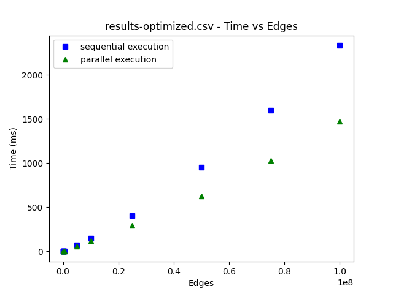
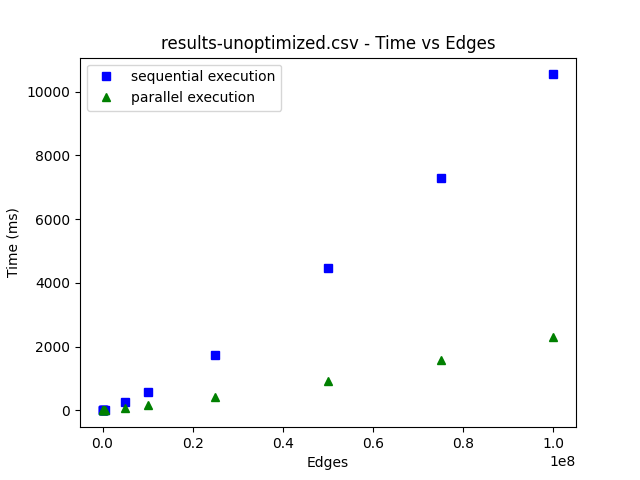
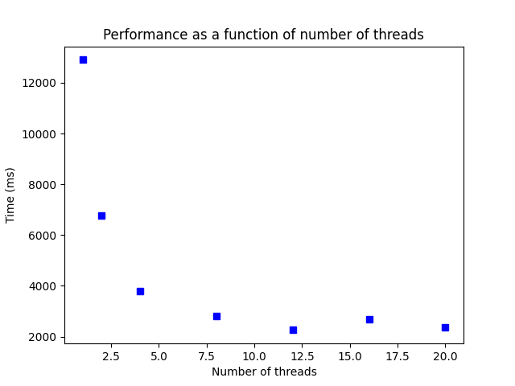

[](https://classroom.github.com/a/urO9t9_z)
# Лабораторная работа № 1: определение достижимости параллелизма и реализация параллельных алгоритмов.

Шаги выполнения:
1) Выберите один из алгоритмов обхода графа (BFS или BFS).
2) Разберитесь с выбранным алгоритмом и выделите основные этапы его выполнения. Идентифицируйте зависимости между этапами и выберите те, которые можно эффективно распараллелить (для этого постройте граф зависимостей (можно в голове))
3) Напишите программу на выбранном вами языке программирования (java, c++), реализующую выбранный алгоритм с учётом параллельных возможностей.
4) С помощью инструментов (ThreadSanitizer && Helgrind для С++, JCStress тесты для Java) проанализировать программу на предмет отсутствия ошибок синхронизации данных. Если ошибок не нашлось, то внести их и найти.
5) Эксперименты и анализ результатов:\
   Проведите эксперименты, измеряя производительность параллельной реализации алгоритма на различных объемах входных данных. Сравните результаты с последовательной версией и опишите полученные выводы.
* Постройте график зависимости времени выполнения параллельной версий алгоритма от выделенных ресурсов.
* Постройте график зависимости времени выполнения параллельной и последовательной версий алгоритма в зависимости от объема входных данных.\

# Решение

### 1
Выбираю BFS

### 2

В основе алгоритма лежит обход по уровням, соответствующий подвешиванию графа за вершины, с которых начинается обход (в нашем случае с одной вершины). 
Эти уровни нужно в явном виде запоминать, поскольку в оригинальном алгоритме их сохранность держится на последовательности обхода очереди.
Мы будем явно хранить очередной уровень вершин и неблокирующим образом (см. класс `safe_vector`) строить следующий уровень.


### 3
Весь код реализован в файле [Graph.cpp](Graph.cpp).
Код [main.cpp](main.cpp) менялся только для упрощения проведения экспериментов.

### 4
Запуски с Hellgrind и с ThreadSanitizer-ом показали отсутствие проблем с многопоточностью.
На искусственно скомпрометированной программе (в которую линкуется [GraphTainted.cpp] с небезопасным `safe_vector`) ThreadSanitizer нашел проблему:
```
WARNING: ThreadSanitizer: data race (pid=1461544)
  Write of size 8 at 0x7ffc9f460bc8 by thread T134:
    #0 safe_vector<int>::push_back(int const&) /home/metametamoon/workspace/learning/university/parallel/lab-1-cpp/GraphTainted.cpp:27:33 (main-sanitized-with-error+0xda184) (BuildId: 2298281292859c76c80da7e983d758c16984159a)
    #1 Graph::parallelBFS(int)::$_1::operator()(long, long) const /home/metametamoon/workspace/learning/university/parallel/lab-1-cpp/GraphTainted.cpp:65:36 (main-sanitized-with-error+0xda184)
    #2 Graph::parallelBFS(int)::$_0::operator()() const /home/metametamoon/workspace/learning/university/parallel/lab-1-cpp/GraphTainted.cpp:73:51 (main-sanitized-with-error+0xda184)
    #3 void std::__invoke_impl<void, Graph::parallelBFS(int)::$_0>(std::__invoke_other, Graph::parallelBFS(int)::$_0&&) /usr/bin/../lib/gcc/x86_64-linux-gnu/12/../../../../include/c++/12/bits/invoke.h:61:14 (main-sanitized-with-error+0xda184)
    #4 std::__invoke_result<Graph::parallelBFS(int)::$_0>::type std::__invoke<Graph::parallelBFS(int)::$_0>(Graph::parallelBFS(int)::$_0&&) /usr/bin/../lib/gcc/x86_64-linux-gnu/12/../../../../include/c++/12/bits/invoke.h:96:14 (main-sanitized-with-error+0xda184)
    #5 void std::thread::_Invoker<std::tuple<Graph::parallelBFS(int)::$_0>>::_M_invoke<0ul>(std::_Index_tuple<0ul>) /usr/bin/../lib/gcc/x86_64-linux-gnu/12/../../../../include/c++/12/bits/std_thread.h:279:13 (main-sanitized-with-error+0xda184)
    #6 std::thread::_Invoker<std::tuple<Graph::parallelBFS(int)::$_0>>::operator()() /usr/bin/../lib/gcc/x86_64-linux-gnu/12/../../../../include/c++/12/bits/std_thread.h:286:11 (main-sanitized-with-error+0xda184)
    #7 std::thread::_State_impl<std::thread::_Invoker<std::tuple<Graph::parallelBFS(int)::$_0>>>::_M_run() /usr/bin/../lib/gcc/x86_64-linux-gnu/12/../../../../include/c++/12/bits/std_thread.h:231:13 (main-sanitized-with-error+0xda184)
    #8 <null> <null> (libstdc++.so.6+0xdc252) (BuildId: e72c155b714bc42a767ec9c0dd94589110e5b42f)

  Previous write of size 8 at 0x7ffc9f460bc8 by thread T133:
    #0 safe_vector<int>::push_back(int const&) /home/metametamoon/workspace/learning/university/parallel/lab-1-cpp/GraphTainted.cpp:27:33 (main-sanitized-with-error+0xda184) (BuildId: 2298281292859c76c80da7e983d758c16984159a)
    #1 Graph::parallelBFS(int)::$_1::operator()(long, long) const /home/metametamoon/workspace/learning/university/parallel/lab-1-cpp/GraphTainted.cpp:65:36 (main-sanitized-with-error+0xda184)
    #2 Graph::parallelBFS(int)::$_0::operator()() const /home/metametamoon/workspace/learning/university/parallel/lab-1-cpp/GraphTainted.cpp:73:51 (main-sanitized-with-error+0xda184)
    #3 void std::__invoke_impl<void, Graph::parallelBFS(int)::$_0>(std::__invoke_other, Graph::parallelBFS(int)::$_0&&) /usr/bin/../lib/gcc/x86_64-linux-gnu/12/../../../../include/c++/12/bits/invoke.h:61:14 (main-sanitized-with-error+0xda184)
    #4 std::__invoke_result<Graph::parallelBFS(int)::$_0>::type std::__invoke<Graph::parallelBFS(int)::$_0>(Graph::parallelBFS(int)::$_0&&) /usr/bin/../lib/gcc/x86_64-linux-gnu/12/../../../../include/c++/12/bits/invoke.h:96:14 (main-sanitized-with-error+0xda184)
    #5 void std::thread::_Invoker<std::tuple<Graph::parallelBFS(int)::$_0>>::_M_invoke<0ul>(std::_Index_tuple<0ul>) /usr/bin/../lib/gcc/x86_64-linux-gnu/12/../../../../include/c++/12/bits/std_thread.h:279:13 (main-sanitized-with-error+0xda184)
    #6 std::thread::_Invoker<std::tuple<Graph::parallelBFS(int)::$_0>>::operator()() /usr/bin/../lib/gcc/x86_64-linux-gnu/12/../../../../include/c++/12/bits/std_thread.h:286:11 (main-sanitized-with-error+0xda184)
    #7 std::thread::_State_impl<std::thread::_Invoker<std::tuple<Graph::parallelBFS(int)::$_0>>>::_M_run() /usr/bin/../lib/gcc/x86_64-linux-gnu/12/../../../../include/c++/12/bits/std_thread.h:231:13 (main-sanitized-with-error+0xda184)
    #8 <null> <null> (libstdc++.so.6+0xdc252) (BuildId: e72c155b714bc42a767ec9c0dd94589110e5b42f)

  Location is stack of main thread.

  Location is global '??' at 0x7ffc9f443000 ([stack]+0x1dbc8)

  Thread T134 (tid=1461679, running) created by main thread at:
    #0 pthread_create <null> (main-sanitized-with-error+0x4f8eb) (BuildId: 2298281292859c76c80da7e983d758c16984159a)
    #1 std::thread::_M_start_thread(std::unique_ptr<std::thread::_State, std::default_delete<std::thread::_State>>, void (*)()) <null> (libstdc++.so.6+0xdc328) (BuildId: e72c155b714bc42a767ec9c0dd94589110e5b42f)
    #2 executeParallelBfsAndGetTime(Graph&) /home/metametamoon/workspace/learning/university/parallel/lab-1-cpp/main.cpp:18:7 (main-sanitized-with-error+0xd8261) (BuildId: 2298281292859c76c80da7e983d758c16984159a)
    #3 run_and_store_experiment_results(std::vector<graph_generation_info, std::allocator<graph_generation_info>>, std::basic_ofstream<char, std::char_traits<char>>&, std::basic_ofstream<char, std::char_traits<char>>&) /home/metametamoon/workspace/learning/university/parallel/lab-1-cpp/main.cpp:39:34 (main-sanitized-with-error+0xd8261)
    #4 main /home/metametamoon/workspace/learning/university/parallel/lab-1-cpp/main.cpp:87:9 (main-sanitized-with-error+0xd87ce) (BuildId: 2298281292859c76c80da7e983d758c16984159a)

  Thread T133 (tid=1461678, running) created by main thread at:
    #0 pthread_create <null> (main-sanitized-with-error+0x4f8eb) (BuildId: 2298281292859c76c80da7e983d758c16984159a)
    #1 std::thread::_M_start_thread(std::unique_ptr<std::thread::_State, std::default_delete<std::thread::_State>>, void (*)()) <null> (libstdc++.so.6+0xdc328) (BuildId: e72c155b714bc42a767ec9c0dd94589110e5b42f)
    #2 executeParallelBfsAndGetTime(Graph&) /home/metametamoon/workspace/learning/university/parallel/lab-1-cpp/main.cpp:18:7 (main-sanitized-with-error+0xd8261) (BuildId: 2298281292859c76c80da7e983d758c16984159a)
    #3 run_and_store_experiment_results(std::vector<graph_generation_info, std::allocator<graph_generation_info>>, std::basic_ofstream<char, std::char_traits<char>>&, std::basic_ofstream<char, std::char_traits<char>>&) /home/metametamoon/workspace/learning/university/parallel/lab-1-cpp/main.cpp:39:34 (main-sanitized-with-error+0xd8261)
    #4 main /home/metametamoon/workspace/learning/university/parallel/lab-1-cpp/main.cpp:87:9 (main-sanitized-with-error+0xd87ce) (BuildId: 2298281292859c76c80da7e983d758c16984159a)

SUMMARY: ThreadSanitizer: data race /home/metametamoon/workspace/learning/university/parallel/lab-1-cpp/GraphTainted.cpp:27:33 in safe_vector<int>::push_back(int const&)
```

Hellgrind по неизвестной мне причине промолчал...

### 5

Disclaimer: для воспроизведения экспериментов достаточно запустить `reproduce.sh`, поправив компилятор языка C++ на существующий в системе в [Makefile](Makefile).
Картинки в [README.md](README.md) обновятся автоматически.

Для уменьшения размерности входных данных будем считать, что ребер всегда в 5 раз больше вершин.
В основном случае мы измеряли производительность при *12* созданных потоках (соответствуется число логических ядер на моей машине) в оптимизированном (`-O3`) и неоптимизированном случае (`-O0`).
Результаты:



В неоптимизированном случае ускорение получается примерно 6-кратным. 
Это число можно было бы приблизить к 12 за счет переиспользования уже созданных потоков (aka Thread pool-а).
За счет отсутствия накладных расходов на блокировку зависимость времени параллльного алгоритма от объема входных данных практически линейная (накладные расходы на создание потоков пропорциональны диаметру графа, который в случайном графе логарифмичен от размера входа).

В оптимизированном случае же последовательный алгоритм значительно ускоряется в ходе компиляции, из-за чего ускорение значительно меньше (т.к. больше доля накладных расходов).

Сравним производительность на наиболее сложном тесте в неоптимизированной версии при увеличении количества потоков:


За счет отсутствия блокировок в алгоритме получается почти идеальная обратная линейная функция с проседанием, когда число созданных потоков превосходит число логических потоков процессора (накладных расходов больше, а загрузка не увеличилась).
